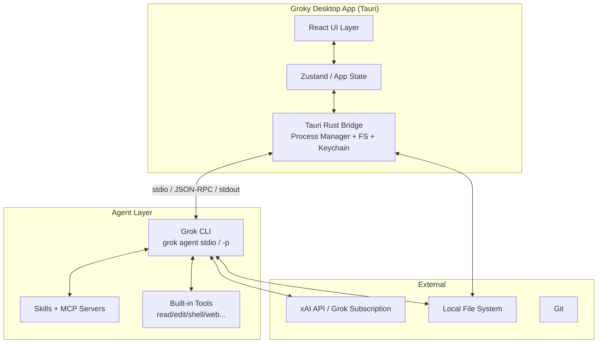

# Groky 架构方案

**版本**：v0.1  
**日期**：2026-06-23

---

## 1. 总体架构原则

1. **复用优先**：Grok Build CLI 已经实现了完整的 agent 循环、工具、Skills、MCP、权限模型。Groky 的核心职责是**可视化 + 交互**，不是重新实现 agent。
2. **分层清晰**：
   - UI 层（React）：展示、交互、状态
   - 桌面桥接层（Tauri Rust / IPC）：进程管理、文件安全、密钥存储
   - Agent 层（Grok CLI）：真正的智能与执行
3. **双模式集成**（策略模式）：
   - **Primary Mode**：ACP（`grok agent stdio`）—— 推荐，功能最完整
   - **Fallback Mode**：Headless streaming-json
   - **Light Mode**：直接调用 xAI API（无 Skills、无完整工具）
4. **安全第一**：所有危险操作必须经过用户显式确认；文件系统访问受控。
5. **渐进式增强**：先做出强大可用的 MVP，再逐步添加高级特性。

---

## 2. 技术栈选型

### 2.1 桌面框架：Tauri 2（强烈推荐）

**理由**：
- 相比 Electron：包体积小 5~10 倍、内存占用低、启动快、原生菜单和通知体验更好。
- Rust 后端天然适合：
  - 安全 spawn 子进程（`grok`）
  - 细粒度文件系统权限
  - 系统密钥链集成（保存 XAI_API_KEY）
  - 未来可扩展原生功能（文件监听、git 等）
- 前端仍可用现代 Web 技术栈（React + TS + Vite）。
- macOS 体验优秀（用户当前使用 macOS）。

**备选**：Electron（如果想最大复用 acks-ai-studio 现有代码和组件）。

### 2.2 前端技术

- **框架**：React 19 + TypeScript
- **构建**：Vite
- **样式**：Tailwind CSS + shadcn/ui（或复用用户现有设计系统）
- **编辑器**：Monaco Editor（VSCode 内核）
- **Markdown 渲染**：remark + rehype + 自定义组件（支持折叠 thinking、diff）
- **状态管理**：
  - 轻量：Zustand 或 Jotai（推荐）
  - 复杂部分：TanStack Query（用于会话、文件列表）
- **图标**：Lucide 或 Heroicons

### 2.3 后端（Tauri Rust）

- Tokio 异步运行时
- `tauri-plugin-shell` + 自定义命令管理子进程
- `tauri-plugin-fs` / `tauri-plugin-dialog`
- `keyring` 或 `tauri-plugin-store` + 系统 keychain 存储敏感信息
- Serde + JSON-RPC 处理 ACP 消息

### 2.4 Grok 集成方式

| 模式               | 命令                          | 优点                                 | 缺点                          | MVP 优先级 |
|--------------------|-------------------------------|--------------------------------------|-------------------------------|------------|
| ACP stdio          | `grok agent stdio -m grok-build-0.1` | 完整协议：session、tool、permission、thought | 需要实现 JSON-RPC 客户端     | ★★★★★     |
| Headless Streaming | `grok -p "..." --output-format streaming-json` | 简单、稳定                         | 每次新进程，session 管理稍麻烦 | ★★★★      |
| Direct xAI API     | `https://api.x.ai/v1`         | 无需本地 CLI                         | 失去 Skills、完整工具、权限模型 | ★★        |

**推荐**：MVP 主推 ACP + Headless 作为降级。

---

## 3. 系统架构图（文字 + Mermaid）



**数据流（典型一次交互）**：

```
用户输入 (Composer)
    ↓
Tauri Command (send_prompt)
    ↓
Bridge 向 grok 进程写入 ACP Request
    ↓
Grok 流式返回事件 (text / thought / tool_call / permission_request ...)
    ↓
Bridge 解析并通过 Tauri Event 发送到前端
    ↓
Zustand 更新 messages + toolExecutions + pendingApprovals
    ↓
UI 实时渲染（ChatPane + ToolTimeline + DiffViewer）
    ↓
用户在 ApprovalModal 操作 → Bridge 回传批准结果给 grok
```

---

## 4. 目录结构建议

```
groky/
├── src-tauri/                  # Tauri Rust 后端
│   ├── src/
│   │   ├── main.rs
│   │   ├── commands.rs         # Tauri invoke commands
│   │   ├── grok/
│   │   │   ├── mod.rs
│   │   │   ├── acp_client.rs   # ACP JSON-RPC 实现（核心）
│   │   │   ├── headless.rs
│   │   │   └── process.rs
│   │   ├── fs.rs
│   │   ├── permissions.rs
│   │   └── settings.rs
│   ├── Cargo.toml
│   └── tauri.conf.json
├── src/                        # React 前端
│   ├── components/
│   │   ├── layout/
│   │   ├── chat/
│   │   ├── composer/
│   │   ├── filetree/
│   │   ├── diff/
│   │   └── modals/
│   ├── stores/                 # Zustand stores
│   ├── hooks/
│   ├── lib/                    # utils, types
│   └── App.tsx
├── docs/                       # PRD、架构、组件等文档
├── design/
├── public/
├── package.json
├── vite.config.ts
└── README.md
```

---

## 5. 关键子系统设计

### 5.1 Grok Process Manager（Rust）

- 负责启动、监控、重启 `grok` 子进程
- 支持两种协议：
  - ACP：双向 JSON-RPC over stdio
  - Headless：单向 stdout streaming + 写入 prompt
- 提供统一抽象 `GrokClient` trait
- 事件总线：把后端事件转发为 Tauri `listen` / `emit`

### 5.2 ACP 客户端实现要点

需要处理的主要消息类型（基于现有文档推断）：
- `session/create`
- `session/prompt` （发送用户消息）
- `session/response` / streaming chunks
- `tool/call` + `tool/result`
- `permission/request` + `permission/response`
- `thought` / internal reasoning

实现时需做好：
- 消息序列化/反序列化
- 请求 ID 关联
- 心跳 / 重连策略
- 优雅关闭

### 5.3 状态管理（前端）

推荐 Zustand 切片设计：

```ts
interface AppState {
  // 项目
  currentProject: Project | null;
  recentProjects: Project[];

  // 会话
  currentSessionId: string | null;
  messages: Message[];           // 包含 tool events
  toolExecutions: ToolExecution[];

  // Agent 状态
  isThinking: boolean;
  pendingApproval: ApprovalRequest | null;

  // UI
  leftPane: 'files' | 'sessions';
  rightPane: 'artifacts' | 'skills' | 'diff' | 'none';

  // 设置
  settings: Settings;
}
```

### 5.4 权限模型桥接

- Grok CLI 会通过 ACP 发起 `permission/request`
- Groky 展示自定义 UI
- 用户选择后通过 ACP `permission/response` 回传
- 同时维护本地权限规则缓存（`allow`, `deny` 规则）

### 5.5 文件系统与变更

- 文件树使用 Tauri fs API + 虚拟滚动（react-window 或自研）
- Diff 使用 Monaco Diff Editor 或自建 react-diff-view
- Apply 操作：
  - 推荐路径：通过 Grok CLI 的 `search_replace` 工具完成（保持一致）
  - 备选：前端直接 patch（需小心冲突）

### 5.6 数据持久化

- 项目设置、最近项目：`tauri-plugin-store` 或本地 JSON
- API Keys：系统 Keychain（`keyring-rs`）
- 会话历史：优先让 Grok CLI 管理（`~/.grok/sessions`），Groky 只缓存 UI 状态
- 本地缓存：IndexedDB（大文件列表、搜索索引）

---

## 6. 安全性与权限

- **最小权限原则**：Rust 侧默认不直接写文件，所有修改走 Grok CLI
- **用户确认**：任何 shell、写文件、网络请求（部分）都必须经过 UI 确认
- **密钥存储**：永不明文存配置文件
- **进程隔离**：grok 子进程与主应用分离
- **Sandbox**：支持透传 Grok 的 `--sandbox` 参数

---

## 7. 构建、打包与分发

- 开发：`tauri dev`
- 构建：`tauri build` → 生产 `.app` / `.dmg`
- 自动更新：Tauri 自带 updater（或 GitHub Releases）
- 代码签名：macOS 需要 Apple 开发者证书
- 发布渠道：GitHub Releases + 可选 Homebrew Cask

---

## 8. 扩展性设计

- **Skills**：前端提供只读列表 + 触发入口；后续支持在线编辑 SKILL.md
- **MCP Servers**：设置页可配置，状态可视化
- **自定义主题**：支持类似 Grok TUI 的 theming
- **插件**：预留前端插件槽位（未来）

---

## 9. 风险与技术债务

1. ACP 协议演进风险 → 做好抽象层 + 版本兼容 + 备选 headless
2. 大型项目性能 → 文件树虚拟化 + 延迟加载目录 + 让 Grok 做重活
3. 状态一致性（grok 内部状态 vs Groky UI） → 以 Grok 为单一真相源
4. 调试难度 → 提供“显示原始 JSON 事件”开发者模式

---

## 10. 下一步技术工作（MVP 启动顺序）

1. Tauri 项目初始化 + 基础布局
2. 设置页 + 本地 Grok 检测 + 认证状态
3. 实现最简 GrokClient（先用 headless streaming 验证全链路）
4. 实现 ACP 客户端基础骨架
5. 聊天流式渲染 + thinking/tool 组件
6. 文件树 + @ 上下文
7. ApprovalModal + 权限回传
8. Diff 预览 + Apply 流程

---

**附录**：参考资料

- `~/.grok/docs/user-guide/14-headless-mode.md`
- `~/.grok/docs/user-guide/15-agent-mode.md`
- ACP 规范：agentclientprotocol.com
- xAI API 文档：docs.x.ai
- 现有 UI 参考：acks-ai-studio/src/components/（ApprovalModal、Composer、ArtifactsPanel）

此架构将随原型验证持续调整。
